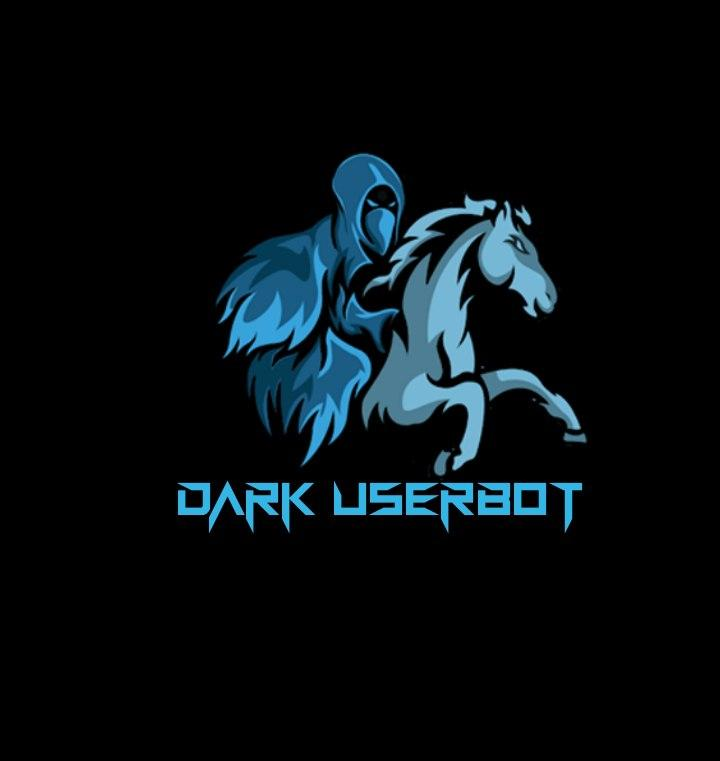

# Dark Userbot

<p align="center">



[](https://www.python.org/)


Telegram hesabınızı idarə etmək üçün ən yaxşı istifadəçi botu
## Ən güclü və daha yaxşı və təhlükəsizdir

## Dark Web Azerbaijan ™ tərəfindən

### Hər hansı bir sorğu və ya necə işlədiyini bilmək istəsəniz Qrup Və Kanala qoşulun

<a href="https://t.me/joinchat/RXQYGVGgmuHhw_tSlzQ0yw"></a>

##Deploy etmək 

### The Easy Way
[](https://heroku.com/deploy?template=https://github.com/spandey112/SensibleUserbot/)

Take Sting session from Replit
[](https://stringsession.sensibleuserbot.repl.run/)
-------------------------------------------------

🔺 UserBot-u Heroku-ya necə yerləşdirmək olar 🔺

     🔹    App name - deployunuza ad qoyun 
       
     🔹    API_HASH  - My.telegram.org saytından gördüyünüz hash yapışdırın

      🔹  APP_ID - My.telegram.org saytından gördüyünüz İD yapışdırın

      🔹 HEROKU_API_KEY - https://dashboard.heroku.com/account daxin olun və reveal it bölməsindən kopyalayın(Bu yeniləməyə kömək edəcək)

     🔹  HEROKU_APP_NAME - deployunuza qoyduğunuz adı buradaa yazın

     🔹  STRING_SESSION - string session hqaaında yazacayıq

     🔹  TG_BOT_TOKEN_BF_HER - @botfather ilə bot yaradın və api tokeni buraya yapışdırın

     🔹  TG_BOT_USER_NAME_BF_HER - yaratdığınız botun adıı yazın ( məsələn @dark_bot )


```python3
from heroku_config import Var

class Development(Var):
  APP_ID = 6
  API_HASH = "eb06d4abfb49dc3eeb1aeb98ae0f581e"
```
7.  Now Click on Deploy App And Wait.

8.   After Complete Go Back To Your App And Click On Resources.

9.  On the free dynos by clicking on the ✏️ sign .

10.  Now go to More Option And Click On Logs And check until complete 

11.  Now go to Botfather, go to the bot settings and select 'Inline Mode' on .

12. Now run .alive and .help command to check bro

### UniBorg Configuration


The UniBorg Config is situated in `userbot/uniborgConfig.py`.

**Heroku Configuration**
Simply just leave the Config as it is.

**Local Configuration**
Fortunately there are no Mandatory vars for the UniBorg Support Config.

## Mandatory Vars

- Only two of the environment variables are mandatory.
- This is because of `telethon.errors.rpc_error_list.ApiIdPublishedFloodError`
    - `APP_ID`:   You can get this value from https://my.telegram.org
    - `API_HASH`:   You can get this value from https://my.telegram.org
- The userbot will not work without setting the mandatory vars.

